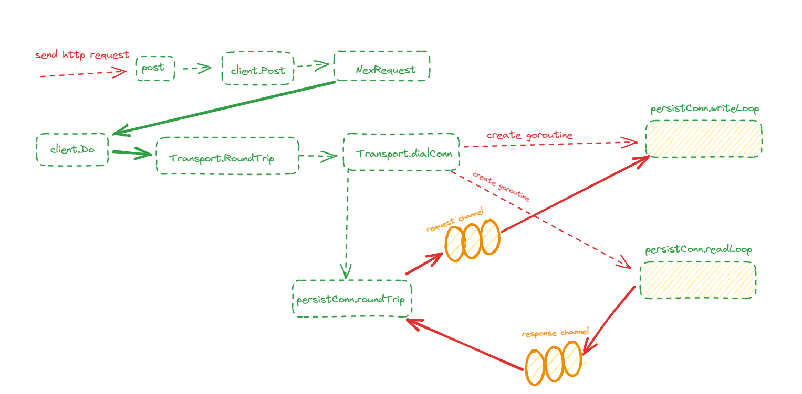

# net/http 底层原理解析

## 1.CS架构示例

服务端代码：

```go
package main

import "net/http"

func main() {

    // 注册对应于请求路径 /ping 的handler函数
	http.HandleFunc("/ping", func(w http.ResponseWriter, r *http.Request) {
		w.Write([]byte("pong"))
	})  

   //启动一个端口为8080的http服务
	err := http.ListenAndServe(":8080", nil)
	if err != nil {
		panic(err)
	}
}

```

客户端单元测试代码：

```sh
package main

import (
	"fmt"
	"io/ioutil"
	"net/http"
	"testing"
)

func Client() {

	rsp, err := http.Post("http://localhost:8080/ping", "", nil)
	if err != nil {
		panic(err)
	}
	str, err := ioutil.ReadAll(rsp.Body)
	if err != nil {
		panic(err)
	}
	defer rsp.Body.Close()
	fmt.Println(string(str))

}

func TestClient(t *testing.T) {
	Client()
}
```


- 源码位置预览

  | 模块             | 文件                  |
  | ---------------- | --------------------- |
  | 服务端           | net/http/server.go    |
  | 客户端--主流程   | net/http/client.go    |
  | 客户端--构造请求 | net/http/request.gp   |
  | 客户端--网络交互 | net/http/transport.go |

  


## 2.服务端

### 2.1 核心数据结构

- （1）Server

  ```go
  type Server struct {
  	// Addr optionally specifies the TCP address for the server to listen on,
  	// in the form "host:port". If empty, ":http" (port 80) is used.
  	// The service names are defined in RFC 6335 and assigned by IANA.
  	// See net.Dial for details of the address format.
  	Addr string      //服务地址
  
  	Handler Handler // 想当于路由处理器。实现从请求路径path到具体处理函数handler的注册和映射能力。在用户构造Server对象时，若其中的Handler字段未显示声明，则会取net/http包下单例对象DefaultServerMux(ServerMux类型)进行兜底
  
  	// DisableGeneralOptionsHandler, if true, passes "OPTIONS *" requests to the Handler,
  	// otherwise responds with 200 OK and Content-Length: 0.
  	DisableGeneralOptionsHandler bool
  
  	// TLSConfig optionally provides a TLS configuration for use
  	// by ServeTLS and ListenAndServeTLS. Note that this value is
  	// cloned by ServeTLS and ListenAndServeTLS, so it's not
  	// possible to modify the configuration with methods like
  	// tls.Config.SetSessionTicketKeys. To use
  	// SetSessionTicketKeys, use Server.Serve with a TLS Listener
  	// instead.
  	TLSConfig *tls.Config
  
  	// ReadTimeout is the maximum duration for reading the entire
  	// request, including the body. A zero or negative value means
  	// there will be no timeout.
  	//
  	// Because ReadTimeout does not let Handlers make per-request
  	// decisions on each request body's acceptable deadline or
  	// upload rate, most users will prefer to use
  	// ReadHeaderTimeout. It is valid to use them both.
  	ReadTimeout time.Duration
  
  	// ReadHeaderTimeout is the amount of time allowed to read
  	// request headers. The connection's read deadline is reset
  	// after reading the headers and the Handler can decide what
  	// is considered too slow for the body. If ReadHeaderTimeout
  	// is zero, the value of ReadTimeout is used. If both are
  	// zero, there is no timeout.
  	ReadHeaderTimeout time.Duration
  
  	// WriteTimeout is the maximum duration before timing out
  	// writes of the response. It is reset whenever a new
  	// request's header is read. Like ReadTimeout, it does not
  	// let Handlers make decisions on a per-request basis.
  	// A zero or negative value means there will be no timeout.
  	WriteTimeout time.Duration
  
  	// IdleTimeout is the maximum amount of time to wait for the
  	// next request when keep-alives are enabled. If IdleTimeout
  	// is zero, the value of ReadTimeout is used. If both are
  	// zero, there is no timeout.
  	IdleTimeout time.Duration
  
  	// MaxHeaderBytes controls the maximum number of bytes the
  	// server will read parsing the request header's keys and
  	// values, including the request line. It does not limit the
  	// size of the request body.
  	// If zero, DefaultMaxHeaderBytes is used.
  	MaxHeaderBytes int
  
  	// TLSNextProto optionally specifies a function to take over
  	// ownership of the provided TLS connection when an ALPN
  	// protocol upgrade has occurred. The map key is the protocol
  	// name negotiated. The Handler argument should be used to
  	// handle HTTP requests and will initialize the Request's TLS
  	// and RemoteAddr if not already set. The connection is
  	// automatically closed when the function returns.
  	// If TLSNextProto is not nil, HTTP/2 support is not enabled
  	// automatically.
  	TLSNextProto map[string]func(*Server, *tls.Conn, Handler)
  
  	// ConnState specifies an optional callback function that is
  	// called when a client connection changes state. See the
  	// ConnState type and associated constants for details.
  	ConnState func(net.Conn, ConnState)
  
  	// ErrorLog specifies an optional logger for errors accepting
  	// connections, unexpected behavior from handlers, and
  	// underlying FileSystem errors.
  	// If nil, logging is done via the log package's standard logger.
  	ErrorLog *log.Logger
  
  	// BaseContext optionally specifies a function that returns
  	// the base context for incoming requests on this server.
  	// The provided Listener is the specific Listener that's
  	// about to start accepting requests.
  	// If BaseContext is nil, the default is context.Background().
  	// If non-nil, it must return a non-nil context.
  	BaseContext func(net.Listener) context.Context
  
  	// ConnContext optionally specifies a function that modifies
  	// the context used for a new connection c. The provided ctx
  	// is derived from the base context and has a ServerContextKey
  	// value.
  	ConnContext func(ctx context.Context, c net.Conn) context.Context
  
  	inShutdown atomic.Bool // true when server is in shutdown
  
  	disableKeepAlives atomic.Bool
  	nextProtoOnce     sync.Once // guards setupHTTP2_* init
  	nextProtoErr      error     // result of http2.ConfigureServer if used
  
  	mu         sync.Mutex
  	listeners  map[*net.Listener]struct{}
  	activeConn map[*conn]struct{}
  	onShutdown []func()
  
  	listenerGroup sync.WaitGroup
  }
  ```


- （2）Handler 

  路由处理器，根据http请求Request中的请求路径path映射到对应的handler处理函数，对请求进行处理和响应。

  ```go
  type Handler interface {
  	ServeHTTP(ResponseWriter, *Request)
  }
  ```

- （3）ServerMux 对Handler 的具体实现，内部通过一个map维护从path到handler的映射关系

  ```go
  type ServeMux struct {
  	mu    sync.RWMutex
  	m     map[string]muxEntry //维护从path到handler的映射关系
  	es    []muxEntry // slice of entries sorted from longest to shortest.
  	hosts bool       // whether any patterns contain hostnames
  }
  ```

- （4）muxEntry 作为一个handler单元，内部包含了请求路径 path + 处理函数handler两部分

  ```go
  type muxEntry struct {
  	h       Handler
  	pattern string
  }
  ```

### 2.2 注册 handler

​	   服务端注册hendler 主干链路：


在net/http包下声明了一个单例ServerMux，当用户直接通过公开方法http.HandleFunc 注册handler时，则会将其注册到 DefaultServeMux 中。

```go
// DefaultServeMux is the default ServeMux used by Serve.
var DefaultServeMux = &defaultServeMux

var defaultServeMux ServeMux
```

```go
// HandleFunc registers the handler function for the given pattern
// in the DefaultServeMux.
// The documentation for ServeMux explains how patterns are matched.
func HandleFunc(pattern string, handler func(ResponseWriter, *Request)) {
	DefaultServeMux.HandleFunc(pattern, handler)
}
```


在ServeMux.HandleFunc 内部将处理函数handler转为实现了ServerHTTP方法的HandlerFunc类型，将其作为Handler interface 的实现类注册到 ServeMux 的路由Map中

```go
// The HandlerFunc type is an adapter to allow the use of
// ordinary functions as HTTP handlers. If f is a function
// with the appropriate signature, HandlerFunc(f) is a
// Handler that calls f.
type HandlerFunc func(ResponseWriter, *Request)

// ServeHTTP calls f(w, r).
func (f HandlerFunc) ServeHTTP(w ResponseWriter, r *Request) {
	f(w, r)
}

// HandleFunc registers the handler function for the given pattern.
func (mux *ServeMux) HandleFunc(pattern string, handler func(ResponseWriter, *Request)) {
	//...
	mux.Handle(pattern, HandlerFunc(handler))
}
```


实现路由注册的核心逻辑位于ServeMux.Handle 方法中，2个核心点：

- 将path 和 handler包装成一个muxEntry，以path为key注册到理由 map ServeMux.m中
- 响应模糊匹配机制，对于以"/"结尾的path,根据path长度将 muxEntry有序插入数组ServeMux.es 中（2.3说明模糊匹配）

```go 
// Handle registers the handler for the given pattern.
// If a handler already exists for pattern, Handle panics.
func (mux *ServeMux) Handle(pattern string, handler Handler) {
	mux.mu.Lock()
	defer mux.mu.Unlock()
	//...
	e := muxEntry{h: handler, pattern: pattern}
	mux.m[pattern] = e
	if pattern[len(pattern)-1] == '/' {
		mux.es = appendSorted(mux.es, e)
	}
    //...
}
```


```go 
func appendSorted(es []muxEntry, e muxEntry) []muxEntry {
	n := len(es)
	i := sort.Search(n, func(i int) bool {
		return len(es[i].pattern) < len(e.pattern)
	})
	if i == n {
		return append(es, e)
	}
	// we now know that i points at where we want to insert
	es = append(es, muxEntry{}) // try to grow the slice in place, any entry works.
	copy(es[i+1:], es[i:])      // Move shorter entries down
	es[i] = e
	return es
}
```

### 2.3 启动server

调用net/http包下的公开方法ListenAndServe，可以实现对服务端一键启动。内部声明初始化了一个新的Server对象，嵌套执行Server.ListenAndServe 方法。

```go
func ListenAndServe(addr string, handler Handler) error {
	server := &Server{Addr: addr, Handler: handler}
	return server.ListenAndServe()
}
```


Server.ListenAndServe 方法中，根据用户传入的地址端口，申请一个监听器Listener，继而调用Server.Serve方法。

```go 

func (srv *Server) ListenAndServe() error {
	if srv.shuttingDown() {
		return ErrServerClosed
	}
	addr := srv.Addr
	if addr == "" {
		addr = ":http"
	}
	ln, err := net.Listen("tcp", addr)
	if err != nil {
		return err
	}
	return srv.Serve(ln)
}
```


Serve.Serve方法很核心，体现了http服务端的运行架构： for + listener.accept模式。

- 将server封装成一组kv对，添加到context中
- 开启for循环，每轮循环调用 listener.accept方法阻塞等待新连接到达
- 每有一个连接到达，创建一个goroutine 异步执行 conn.serve方法处理

```go
ServerContextKey = &contextKey{"http-server"}

type contextKey struct {
	name string
}
```

```go

func (srv *Server) Serve(l net.Listener) error {
	//...
	ctx := context.WithValue(baseCtx, ServerContextKey, srv)
	for {
		rw, err := l.Accept()
		//...
		connCtx := ctx
		//...
		c := srv.newConn(rw)
		//...
		go c.serve(connCtx)
	}
}

```


 conn.serve方法是响应客户端连接的核心方法：

- 从conn中读取到封装到response结构体，以及请求参数http.Request
- 调用ServerHandler.ServeHTTP方法，根据请求的path 为其分配handler
- 通过特定的handler处理并响应请求

```go
// Serve a new connection.
func (c *conn) serve(ctx context.Context) {
    //...
	// HTTP/1.x from here on.
	ctx, cancelCtx := context.WithCancel(ctx)
	c.cancelCtx = cancelCtx
	defer cancelCtx()

	c.r = &connReader{conn: c}
	c.bufr = newBufioReader(c.r)
	c.bufw = newBufioWriterSize(checkConnErrorWriter{c}, 4<<10)

	for {
		w, err := c.readRequest(ctx)
		//...
		serverHandler{c.server}.ServeHTTP(w, w.req)
		//...
		w.cancelCtx()
		//...
	}
}
```


ServerHandler.ServeHTTP方法会对Handler做判断，倘若其未声明，则取全局单例DefaultServeMux进行路由匹配，呼应了http.HandleFunc中的处理细节

```go
func (sh serverHandler) ServeHTTP(rw ResponseWriter, req *Request) {
	handler := sh.srv.Handler
	if handler == nil {
		handler = DefaultServeMux
	}
		//....
	handler.ServeHTTP(rw, req)
}
```


接下来，兜兜转转依次调用ServeMux.ServeHTTP、ServeMux.Handler、ServeMux.handler等方法，最终在ServeMux.match方法中，以Request中的path为pattern ，在路由字典 Server.m中匹配handler，最后调用handler.ServeHTTP方法进行请求的处理和响应

```go

func (mux *ServeMux) ServeHTTP(w ResponseWriter, r *Request) {
//...
	h, _ := mux.Handler(r)//在路由字典 Server.m中匹配handler
	h.ServeHTTP(w, r) //最后调用handler.ServeHTTP方法进行请求的处理和响应
}


func (mux *ServeMux) Handler(r *Request) (h Handler, pattern string) {
    //...
	return mux.handler(host, r.URL.Path)
}


func (mux *ServeMux) handler(host, path string) (h Handler, pattern string) {
	mux.mu.RLock()
	defer mux.mu.RUnlock()

	// Host-specific pattern takes precedence over generic ones
	if mux.hosts {
		h, pattern = mux.match(host + path)
	}
	if h == nil {
		h, pattern = mux.match(path)
	}
	if h == nil {
		h, pattern = NotFoundHandler(), ""
	}
	return
}

```


当通过路由字典ServeMux.m未命中handler时，此时会启动模糊匹配模式，两个核心规则：

- 以 '/'结尾的patterns才能被添加到ServeMux.es数组中，才有资格参与模糊匹配
- 模糊匹配时，会找一个与请求路径path的前缀完全匹配且长度最长的pattern，取其对应的handler作为本次请求的处理函数

```go
// Find a handler on a handler map given a path string.
// Most-specific (longest) pattern wins.
func (mux *ServeMux) match(path string) (h Handler, pattern string) {
	// Check for exact match first.
	v, ok := mux.m[path]
	if ok {
		return v.h, v.pattern
	}

	// Check for longest valid match.  mux.es contains all patterns
	// that end in / sorted from longest to shortest. 由长到短排序
	for _, e := range mux.es {
		if strings.HasPrefix(path, e.pattern) {
			return e.h, e.pattern
		}
	}
	return nil, ""
}
```

## 3.客户端

### 3.1 核心数据结构

(1) Client

与Server对仗，客户端模块有一个Client类，实体对于整个模块的封装：

```go
type Client struct {

	Transport RoundTripper //负责http通信的核心部分

	CheckRedirect func(req *Request, via []*Request) error

	Jar CookieJar //Cookie管理

	Timeout time.Duration  //超时设置
}
```

（2）RoundTripper 是通信模块的 interface ,需要实现方法 RoundTrip，即通过传入的请求 Request，与服务端交互后获得响应Response

```go
type RoundTripper interface {
	RoundTrip(*Request) (*Response, error)
}
```

（3）Transport 是 RoundTripper的实现类，核心字段包括：

```go

type Transport struct {
    //....
	idleConn     map[connectMethodKey][]*persistConn //空闲连接map,实现复用
    //....
    DialContext func(ctx context.Context, network, addr string) (net.Conn, error) //新连接器
    //....
}
```


（4）Request

​	http请求参数结构体	

```go
type Request struct {
	Method string //请求方法(GET, POST, PUT, etc.).
	URL *url.URL //请求路径
	Proto      string // "HTTP/1.0" 请求协议
	Header Header //请求头
	Body io.ReadCloser //请求参数内容
    Host string  //服务器主机
	Form url.Values //query 请求参数
	Response *Response //响应参数struct
	ctx context.Context //请求链路上下文
     //......
}
```


（5）Response

http响应参数结构体

```go
type Response struct {
	Status     string // e.g. "200 OK" 
	StatusCode int    // e.g. 200    请求状态码 200-请求成功
	Proto      string // e.g. "HTTP/1.0" 协议类型：http协议
	Header Header     //请求头
	Body io.ReadCloser //响应参数内容
	Request *Request  //指向请求参数
    //......
}
```

### 3.2 方法链路

客户端发起一次http请求大致分为以下步骤：

- 构造http请求参数
- 获取与服务端交互的tcp连接
- 通过tcp连接发送请求参数
- 通过tcp连接接收响应参数

整体方法链路：



### 3.3 Client.Post

调用net/http 包下的公开方法Post时，需要传入服务端地址url，请求参数格式 contentType 以及请求参数的 io reader 

方法中会使用包下的单例客户端  DefaultClient 处理本次请求：

```go
// DefaultClient is the default Client and is used by Get, Head, and Post.
var DefaultClient = &Client{}

func Post(url, contentType string, body io.Reader) (resp *Response, err error) {
	return DefaultClient.Post(url, contentType, body)
}


```


Client.Post方法，首先会结合用户的入参，NewRequest构造完整的请求参数Request ，继而通过Client.Do方法处理这次请求。

```go
func (c *Client) Post(url, contentType string, body io.Reader) (resp *Response, err error) {
	req, err := NewRequest("POST", url, body)
	if err != nil {
		return nil, err
	}
	req.Header.Set("Content-Type", contentType)
	return c.Do(req)
}
```

### 3.4 NewRequest 

NewRequest 方法中，返回NewRequestWithContext方法，其根据用户传入的method 、url、请求参数内容，构造Request实例。

```go
func NewRequestWithContext(ctx context.Context, method, url string, body io.Reader) (*Request, error) {
	//...
	u, err := urlpkg.Parse(url)
	//...
	rc, ok := body.(io.ReadCloser)
	if !ok && body != nil {
		rc = io.NopCloser(body)
	}
	//...
	req := &Request{
		ctx:        ctx,
		Method:     method,
		URL:        u,
		Proto:      "HTTP/1.1",
		ProtoMajor: 1,
		ProtoMinor: 1,
		Header:     make(Header),
		Body:       rc,
		Host:       u.Host,
	}
	//...
	return req, nil
}
```

### 3.5 Client.Do

```go
func (c *Client) Do(req *Request) (*Response, error) {
	return c.do(req)
}

```

```go
func (c *Client) do(req *Request) (retres *Response, reterr error) {
	//...	
	var (
		deadline      = c.deadline()
		reqs          []*Request
		resp          *Response
	//...
	)
	//...
	for {
		//...
		var didTimeout func() bool
		if resp, didTimeout, err = c.send(req, deadline); err != nil {
			//...
		}
	//...
}
```

在 Client.send 方法中，通过send方法发送请求之前和之后，分别对Cookies进行更新。

```go
// didTimeout is non-nil only if err != nil.
func (c *Client) send(req *Request, deadline time.Time) (resp *Response, didTimeout func() bool, err error) {
    //设置cookie到请求头中
	if c.Jar != nil {
		for _, cookie := range c.Jar.Cookies(req.URL) {
			req.AddCookie(cookie)
		}
	}
    //发送请求
	resp, didTimeout, err = send(req, c.transport(), deadline)
	if err != nil {
		return nil, didTimeout, err
	}
    //更新resp的cookie到请求头中
	if c.Jar != nil {
		if rc := resp.Cookies(); len(rc) > 0 {
			c.Jar.SetCookies(req.URL, rc)
		}
	}
	return resp, nil, nil
}
```

在调用send方法时，需要注入RoundTripper 模块，默认会使用全局单例DefaultTransport进行注入，核心逻辑在于**Transport.RoundTrip** 方法中，其实分为两步骤：

- 获取/构造tcp连接
- 通过tcp连接完成与服务端的交互。

```go
var DefaultTransport RoundTripper = &Transport{
	//...
	DialContext: defaultTransportDialContext(&net.Dialer{
		Timeout:   30 * time.Second,
		KeepAlive: 30 * time.Second,
	}),
//...
}

func (c *Client) transport() RoundTripper {
	if c.Transport != nil {
		return c.Transport
	}
	return DefaultTransport
}

```

```go
func send(ireq *Request, rt RoundTripper, deadline time.Time) (resp *Response, didTimeout func() bool, err error) {
	//....
	resp, err = rt.RoundTrip(req)
    //...
    return resp, nil, nil
}
```

```go
func (t *Transport) RoundTrip(req *Request) (*Response, error) {
	return t.roundTrip(req)
}
```

```go
// roundTrip implements a RoundTripper over HTTP.
func (t *Transport) roundTrip(req *Request) (*Response, error) {
	//...
	for {
		select {
		case <-ctx.Done():
			req.closeBody()
			return nil, ctx.Err()
		default:
		}

		// treq gets modified by roundTrip, so we need to recreate for each retry.
		treq := &transportRequest{Request: req, trace: trace, cancelKey: cancelKey}
		cm, err := t.connectMethodForRequest(treq)
		if err != nil {
			req.closeBody()
			return nil, err
		}

		// Get the cached or newly-created connection to either the
		// host (for http or https), the http proxy, or the http proxy
		// pre-CONNECTed to https server. In any case, we'll be ready
		// to send it requests.
		pconn, err := t.getConn(treq, cm)
	    //...

		var resp *Response
		if pconn.alt != nil {
			// HTTP/2 path.
			t.setReqCanceler(cancelKey, nil) // not cancelable with CancelRequest
			resp, err = pconn.alt.RoundTrip(req)
		} else {
			resp, err = pconn.roundTrip(treq)
		}
		//...
    }     
}
```

### 3.6 Transport.getConn

获取TCP连接的策略分为两步：

- 通过queueForIdleConn方法尝试复用采用相同协议，访问相同服务端的空闲连接
- 倘若无连接，则通过queueForDial方法，异步创建一个新的连接，并通过接收ready channel的信号方式，确认构造连接工作完成。

```go
// getConn dials and creates a new persistConn to the target as
// specified in the connectMethod. This includes doing a proxy CONNECT
// and/or setting up TLS.  If this doesn't return an error, the persistConn
// is ready to write requests to.
func (t *Transport) getConn(treq *transportRequest, cm connectMethod) (pc *persistConn, err error) {
	//获取连接的请求参数体
	w := &wantConn{
		cm:         cm,
		key:        cm.key(), //key由http协议、服务端地址等信息组成
		ctx:        ctx,
		ready:      make(chan struct{}, 1),  //ready标识连接构造成功的信号发射器
		beforeDial: testHookPrePendingDial,
		afterDial:  testHookPostPendingDial,
	}
    //倘若连接获取失败，在 wantConn.cancel方法中，尝试将tcp连接放回队列中以供后续复用
	defer func() {
		if err != nil {
			w.cancel(t, err)
		}
	}()

	// Queue for idle connection. 尝试复用指向相同服务端地址的空闲连接
	if delivered := t.queueForIdleConn(w); delivered {
		pc := w.pc
		//...
		return pc, nil
	}
	//...
	// Queue for permission to dial.   异步构造新的连接
	t.queueForDial(w)

	// Wait for completion or cancellation. 
	select {
	case <-w.ready:   //通过阻塞等待信号的方式，等待连接获取完成
		//...
		return w.pc, w.err
		//...
	}
}
```

#### (1) 复用连接

- 尝试从Transport.idleConn中获取指向同一服务端的空闲连接persistConn
- 获取到连接后会调用wantConn.tryDeliver 方法将连接绑定到wantConn请求参数上】
- 绑定成功后，会关闭wantConn.reday channel，以唤醒阻塞读取该channel的goroutine

```go
func (t *Transport) queueForIdleConn(w *wantConn) (delivered bool) {
    //...
	if list, ok := t.idleConn[w.key]; ok {
		//...
		for len(list) > 0 && !stop {
			pconn := list[len(list)-1]
		//...
			delivered = w.tryDeliver(pconn, nil)
			if delivered {
					//...
					list = list[:len(list)-1]
				}
			}
			stop = true
		}
		//...
		if stop {
			return delivered
		}
	}
	//...
	return false
}

```

```go
// tryDeliver attempts to deliver pc, err to w and reports whether it succeeded.
func (w *wantConn) tryDeliver(pc *persistConn, err error) bool {
	w.mu.Lock()
	defer w.mu.Unlock()
	//...
	w.pc = pc
	w.err = err
	//...
	close(w.ready)
	return true
}
```

#### (2) 创建连接

在queueForDial方法中会异步调用Transport.dialConnFor方法，创建新的tcp连接，由于是异步操作，所以在上游会通过读取channel的方式，等待创建操作完成。

这里之所以采用异步操作进行连接创建，有两部分原因：

- 一个tcp连接并不是一个静态的数据结构，它是有生命周期的，创建过程中会为其创建负责读写的两个守护协程，伴随而生。
- 在上游Transport.queueForIdleConn方法中，当通过select多路复用的方式，接受到其他终止信号时，可以提前调用wantConn.cancel方法打断创建连接的goroutine ，相比于串行化执行，异步交互更有灵活性。

```go
func (t *Transport) queueForDial(w *wantConn) {
	//....
	go t.dialConnFor(w)
	//...
}
```

Transport.dialConnFor方法中，首先调用 Transport.dialConn 创建tcp连接persistConn，接着执行wantConn.tryDeliver方法，将连接绑定到wantConn上，然后通过关闭ready channel 操作唤醒上游读 ready channel 的goroutine。

```go

func (t *Transport) dialConnFor(w *wantConn) {
	defer w.afterDial()
	//...
	pc, err := t.dialConn(w.ctx, w.cm)
	delivered := w.tryDeliver(pc, err)
	//...
}
```


 Transport.dialConn  方法包含了创建tcp连接的核心逻辑：

- 调用Transport.dial方法，最终通过Transport.DialContext成员函数，创建好tcp连接，封装到persistConn中。
- 异步启动连接伴生读写协程 readLoop 和 writeLoop 方法，组成提交请求、接收响应的循环

```go
func (t *Transport) dialConn(ctx context.Context, cm connectMethod) (pconn *persistConn, err error) {
    	pconn = &persistConn{
		t:             t,
		cacheKey:      cm.key(),
		reqch:         make(chan requestAndChan, 1),
		writech:       make(chan writeRequest, 1),
		//...
	}
    conn, err := t.dial(ctx, "tcp", cm.addr())
	//...
	pconn.conn = conn
    //...
    go pconn.readLoop()
	go pconn.writeLoop()
	return pconn, nil
}
```

```go
func (t *Transport) dial(ctx context.Context, network, addr string) (net.Conn, error) {
	//...
	return t.DialContext(ctx, network, addr)
	//...
}
```


```go
// tryDeliver attempts to deliver pc, err to w and reports whether it succeeded.
func (w *wantConn) tryDeliver(pc *persistConn, err error) bool {
	w.mu.Lock()
	defer w.mu.Unlock()

	if w.pc != nil || w.err != nil {
		return false
	}

	w.pc = pc
	w.err = err
	if w.pc == nil && w.err == nil {
		panic("net/http: internal error: misuse of tryDeliver")
	}
	close(w.ready)
	return true
}
```


persistConn.readLoop 方法中，会读取来自服务端的响应，并添加到persistConn.reqch中，供给上游persistConn.roundTrip方法接收。

```go
func (pc *persistConn) readLoop() {
	//...
	alive := true
	for alive {
		//...
		rc := <-pc.reqch
		//...
		var resp *Response
		//...
		resp, err = pc.readResponse(rc, trace)
        //...
		select {
		case rc.ch <- responseAndError{res: resp}:
		case <-rc.callerGone:
			return
		}
}
```


persistConn.writeLoop方法中，会通过persistConn.writech读取到客户端提交的信息，然后将其发送到服务端。

```go
func (pc *persistConn) writeLoop() {
	//...
	for {
		select {
		case wr := <-pc.writech:
			//...
			err := wr.req.Request.write(pc.bw, pc.isProxy, wr.req.extra, pc.waitForContinue(wr.continueCh))
			//...
        }
}
```


#### (3) 归还连接

有复用连接的能力，就必然存在有归还连接的机制

首先，在构造新连接中途，倘若被打断，则可能会将连接放回队列以供复用

```go
func (t *Transport) getConn(treq *transportRequest, cm connectMethod) (pc *persistConn, err error) {
	//....
    //倘若连接获取失败，在 wantConn.cancel方法中，尝试将tcp连接放回队列中以供后续复用
	defer func() {
		if err != nil {
			w.cancel(t, err)
		}
    }()
	//....
}
```

```go
func (w *wantConn) cancel(t *Transport, err error) {
	w.mu.Lock()
	if w.pc == nil && w.err == nil {
		close(w.ready) // catch misbehavior in future delivery
	}
	pc := w.pc
	w.pc = nil
	w.err = err
	w.mu.Unlock()

	if pc != nil {
		t.putOrCloseIdleConn(pc)
	}
}
```

```go
func (t *Transport) putOrCloseIdleConn(pconn *persistConn) {
	if err := t.tryPutIdleConn(pconn); err != nil {
		pconn.close(err)
	}
}

func (t *Transport) tryPutIdleConn(pconn *persistConn) error {
	//...
	key := pconn.cacheKey
	//...
	t.idleConn[key] = append(idles, pconn)
	t.idleLRU.add(pconn)
    //...
	return nil
}
```

其次，倘若与服务端的一轮交互流程结束，也会将连接放回队列以供复用

```go
func (pc *persistConn) readLoop() {
  	//...
    tryPutIdleConn := func(trace *httptrace.ClientTrace) bool {
		if err := pc.t.tryPutIdleConn(pc); err != nil {
			//...
		}
        //...
	}
    
   alive := true
   for alive {
       		select {
                case bodyEOF := <-waitForBodyRead:
            	//...
                tryPutIdleConn(trace)
                //...
            } 
    }
}
```

### 3.7 persistConn.roundTrip

- 首先将http请求通过persistConn.writech发送给连接的守护协程writeLoop，并进一步传送到服务端
- 其次通过读取 resc channel ，接收由守护协程readLoop代理转发的客户端响应数据。

```go
func (pc *persistConn) roundTrip(req *transportRequest) (resp *Response, err error) {
	//...
	writeErrCh := make(chan error, 1)
	pc.writech <- writeRequest{req, writeErrCh, continueCh}

	resc := make(chan responseAndError)
	pc.reqch <- requestAndChan{
		req:        req.Request,
		cancelKey:  req.cancelKey,
		ch:         resc,
		//...
	}
	//...
	for {
		testHookWaitResLoop()
		select {
			//...
		case re := <-resc:
				//...
			return re.res, nil
		//...
		}
	}
}
```


