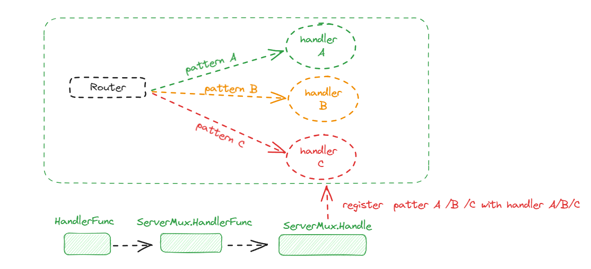

# net/http 底层原理解析

## 1.CS架构示例

服务端代码：

```go
package main

import "net/http"

func main() {

    // 注册对应于请求路径 /ping 的handler函数
	http.HandleFunc("/ping", func(w http.ResponseWriter, r *http.Request) {
		w.Write([]byte("pong"))
	})  

   //启动一个端口为8080的http服务
	err := http.ListenAndServe(":8080", nil)
	if err != nil {
		panic(err)
	}
}

```

客户端单元测试代码：

```sh
package main

import (
	"fmt"
	"io/ioutil"
	"net/http"
	"testing"
)

func Client() {

	rsp, err := http.Post("http://localhost:8080/ping", "", nil)
	if err != nil {
		panic(err)
	}
	str, err := ioutil.ReadAll(rsp.Body)
	if err != nil {
		panic(err)
	}
	defer rsp.Body.Close()
	fmt.Println(string(str))

}

func TestClient(t *testing.T) {
	Client()
}
```

## 2.服务端

### 2.1 核心数据结构

- （1）Server

  ```go
  type Server struct {
  	// Addr optionally specifies the TCP address for the server to listen on,
  	// in the form "host:port". If empty, ":http" (port 80) is used.
  	// The service names are defined in RFC 6335 and assigned by IANA.
  	// See net.Dial for details of the address format.
  	Addr string      //服务地址
  
  	Handler Handler // 想当于路由处理器。实现从请求路径path到具体处理函数handler的注册和映射能力。在用户构造Server对象时，若其中的Handler字段未显示声明，则会取net/http包下单例对象DefaultServerMux(ServerMux类型)进行兜底
  
  	// DisableGeneralOptionsHandler, if true, passes "OPTIONS *" requests to the Handler,
  	// otherwise responds with 200 OK and Content-Length: 0.
  	DisableGeneralOptionsHandler bool
  
  	// TLSConfig optionally provides a TLS configuration for use
  	// by ServeTLS and ListenAndServeTLS. Note that this value is
  	// cloned by ServeTLS and ListenAndServeTLS, so it's not
  	// possible to modify the configuration with methods like
  	// tls.Config.SetSessionTicketKeys. To use
  	// SetSessionTicketKeys, use Server.Serve with a TLS Listener
  	// instead.
  	TLSConfig *tls.Config
  
  	// ReadTimeout is the maximum duration for reading the entire
  	// request, including the body. A zero or negative value means
  	// there will be no timeout.
  	//
  	// Because ReadTimeout does not let Handlers make per-request
  	// decisions on each request body's acceptable deadline or
  	// upload rate, most users will prefer to use
  	// ReadHeaderTimeout. It is valid to use them both.
  	ReadTimeout time.Duration
  
  	// ReadHeaderTimeout is the amount of time allowed to read
  	// request headers. The connection's read deadline is reset
  	// after reading the headers and the Handler can decide what
  	// is considered too slow for the body. If ReadHeaderTimeout
  	// is zero, the value of ReadTimeout is used. If both are
  	// zero, there is no timeout.
  	ReadHeaderTimeout time.Duration
  
  	// WriteTimeout is the maximum duration before timing out
  	// writes of the response. It is reset whenever a new
  	// request's header is read. Like ReadTimeout, it does not
  	// let Handlers make decisions on a per-request basis.
  	// A zero or negative value means there will be no timeout.
  	WriteTimeout time.Duration
  
  	// IdleTimeout is the maximum amount of time to wait for the
  	// next request when keep-alives are enabled. If IdleTimeout
  	// is zero, the value of ReadTimeout is used. If both are
  	// zero, there is no timeout.
  	IdleTimeout time.Duration
  
  	// MaxHeaderBytes controls the maximum number of bytes the
  	// server will read parsing the request header's keys and
  	// values, including the request line. It does not limit the
  	// size of the request body.
  	// If zero, DefaultMaxHeaderBytes is used.
  	MaxHeaderBytes int
  
  	// TLSNextProto optionally specifies a function to take over
  	// ownership of the provided TLS connection when an ALPN
  	// protocol upgrade has occurred. The map key is the protocol
  	// name negotiated. The Handler argument should be used to
  	// handle HTTP requests and will initialize the Request's TLS
  	// and RemoteAddr if not already set. The connection is
  	// automatically closed when the function returns.
  	// If TLSNextProto is not nil, HTTP/2 support is not enabled
  	// automatically.
  	TLSNextProto map[string]func(*Server, *tls.Conn, Handler)
  
  	// ConnState specifies an optional callback function that is
  	// called when a client connection changes state. See the
  	// ConnState type and associated constants for details.
  	ConnState func(net.Conn, ConnState)
  
  	// ErrorLog specifies an optional logger for errors accepting
  	// connections, unexpected behavior from handlers, and
  	// underlying FileSystem errors.
  	// If nil, logging is done via the log package's standard logger.
  	ErrorLog *log.Logger
  
  	// BaseContext optionally specifies a function that returns
  	// the base context for incoming requests on this server.
  	// The provided Listener is the specific Listener that's
  	// about to start accepting requests.
  	// If BaseContext is nil, the default is context.Background().
  	// If non-nil, it must return a non-nil context.
  	BaseContext func(net.Listener) context.Context
  
  	// ConnContext optionally specifies a function that modifies
  	// the context used for a new connection c. The provided ctx
  	// is derived from the base context and has a ServerContextKey
  	// value.
  	ConnContext func(ctx context.Context, c net.Conn) context.Context
  
  	inShutdown atomic.Bool // true when server is in shutdown
  
  	disableKeepAlives atomic.Bool
  	nextProtoOnce     sync.Once // guards setupHTTP2_* init
  	nextProtoErr      error     // result of http2.ConfigureServer if used
  
  	mu         sync.Mutex
  	listeners  map[*net.Listener]struct{}
  	activeConn map[*conn]struct{}
  	onShutdown []func()
  
  	listenerGroup sync.WaitGroup
  }
  ```


- （2）Handler 

  路由处理器，根据http请求Request中的请求路径path映射到对应的handler处理函数，对请求进行处理和响应。

  ```go
  type Handler interface {
  	ServeHTTP(ResponseWriter, *Request)
  }
  ```

- （3）ServerMux 对Handler 的具体实现，内部通过一个map维护从path到handler的映射关系

  ```go
  type ServeMux struct {
  	mu    sync.RWMutex
  	m     map[string]muxEntry //维护从path到handler的映射关系
  	es    []muxEntry // slice of entries sorted from longest to shortest.
  	hosts bool       // whether any patterns contain hostnames
  }
  ```

- （4）muxEntry 作为一个handler单元，内部包含了请求路径 path + 处理函数handler两部分

  ```go
  type muxEntry struct {
  	h       Handler
  	pattern string
  }
  ```

### 2.2 注册 handler

​	   服务端注册hendler 主干链路：




在net/http包下声明了一个单例ServerMux，当用户直接通过公开方法http.HandleFunc 注册handler时，则会将其注册到 DefaultServeMux 中。

```go
// DefaultServeMux is the default ServeMux used by Serve.
var DefaultServeMux = &defaultServeMux

var defaultServeMux ServeMux
```

```go
// HandleFunc registers the handler function for the given pattern
// in the DefaultServeMux.
// The documentation for ServeMux explains how patterns are matched.
func HandleFunc(pattern string, handler func(ResponseWriter, *Request)) {
	DefaultServeMux.HandleFunc(pattern, handler)
}
```


在ServeMux.HandleFunc 内部将处理函数handler转为实现了ServerHTTP方法的HandlerFunc类型，将其作为Handler interface 的实现类注册到 ServeMux 的路由Map中

```go
// The HandlerFunc type is an adapter to allow the use of
// ordinary functions as HTTP handlers. If f is a function
// with the appropriate signature, HandlerFunc(f) is a
// Handler that calls f.
type HandlerFunc func(ResponseWriter, *Request)

// ServeHTTP calls f(w, r).
func (f HandlerFunc) ServeHTTP(w ResponseWriter, r *Request) {
	f(w, r)
}

// HandleFunc registers the handler function for the given pattern.
func (mux *ServeMux) HandleFunc(pattern string, handler func(ResponseWriter, *Request)) {
	//...
	mux.Handle(pattern, HandlerFunc(handler))
}
```


实现路由注册的核心逻辑位于ServeMux.Handle 方法中，2个核心点：

- 将path 和 handler包装成一个muxEntry，以path为key注册到理由 map ServeMux.m中
- 响应模糊匹配机制，对于以"/"结尾的path,根据path长度将 muxEntry有序插入数组ServeMux.es 中（2.3说明模糊匹配）

```go 
// Handle registers the handler for the given pattern.
// If a handler already exists for pattern, Handle panics.
func (mux *ServeMux) Handle(pattern string, handler Handler) {
	mux.mu.Lock()
	defer mux.mu.Unlock()
	//...
	e := muxEntry{h: handler, pattern: pattern}
	mux.m[pattern] = e
	if pattern[len(pattern)-1] == '/' {
		mux.es = appendSorted(mux.es, e)
	}
    //...
}
```


```go 
func appendSorted(es []muxEntry, e muxEntry) []muxEntry {
	n := len(es)
	i := sort.Search(n, func(i int) bool {
		return len(es[i].pattern) < len(e.pattern)
	})
	if i == n {
		return append(es, e)
	}
	// we now know that i points at where we want to insert
	es = append(es, muxEntry{}) // try to grow the slice in place, any entry works.
	copy(es[i+1:], es[i:])      // Move shorter entries down
	es[i] = e
	return es
}
```

### 2.3 启动server

调用net/http包下的公开方法ListenAndServe，可以实现对服务端一键启动。内部声明初始化了一个新的Server对象，嵌套执行Server.ListenAndServe 方法。

```go
func ListenAndServe(addr string, handler Handler) error {
	server := &Server{Addr: addr, Handler: handler}
	return server.ListenAndServe()
}
```


Server.ListenAndServe 方法中，根据用户传入的地址端口，申请一个监听器Listener，继而调用Server.Serve方法。

```go 

func (srv *Server) ListenAndServe() error {
	if srv.shuttingDown() {
		return ErrServerClosed
	}
	addr := srv.Addr
	if addr == "" {
		addr = ":http"
	}
	ln, err := net.Listen("tcp", addr)
	if err != nil {
		return err
	}
	return srv.Serve(ln)
}
```


Serve.Serve方法很核心，体现了http服务端的运行架构： for + listener.accept模式。

- 将server封装成一组kv对，添加到context中
- 开启for循环，每轮循环调用 listener.accept方法阻塞等待新连接到达
- 每有一个连接到达，创建一个goroutine 异步执行 conn.serve方法处理

```go
ServerContextKey = &contextKey{"http-server"}

type contextKey struct {
	name string
}
```

```go

func (srv *Server) Serve(l net.Listener) error {
	//...
	ctx := context.WithValue(baseCtx, ServerContextKey, srv)
	for {
		rw, err := l.Accept()
		//...
		connCtx := ctx
		//...
		c := srv.newConn(rw)
		//...
		go c.serve(connCtx)
	}
}

```


 conn.serve方法是响应客户端连接的核心方法：

- 从conn中读取到封装到response结构体，以及请求参数http.Request
- 调用ServerHandler.ServeHTTP方法，根据请求的path 为其分配handler
- 通过特定的handler处理并响应请求

```go
// Serve a new connection.
func (c *conn) serve(ctx context.Context) {
    //...
	// HTTP/1.x from here on.
	ctx, cancelCtx := context.WithCancel(ctx)
	c.cancelCtx = cancelCtx
	defer cancelCtx()

	c.r = &connReader{conn: c}
	c.bufr = newBufioReader(c.r)
	c.bufw = newBufioWriterSize(checkConnErrorWriter{c}, 4<<10)

	for {
		w, err := c.readRequest(ctx)
		//...
		serverHandler{c.server}.ServeHTTP(w, w.req)
		//...
		w.cancelCtx()
		//...
	}
}
```


ServerHandler.ServeHTTP方法会对Handler做判断，倘若其未声明，则取全局单例DefaultServeMux进行路由匹配，呼应了http.HandleFunc中的处理细节

```go
func (sh serverHandler) ServeHTTP(rw ResponseWriter, req *Request) {
	handler := sh.srv.Handler
	if handler == nil {
		handler = DefaultServeMux
	}
		//....
	handler.ServeHTTP(rw, req)
}
```


接下来，兜兜转转依次调用ServeMux.ServeHTTP、ServeMux.Handler、ServeMux.handler等方法，最终在ServeMux.match方法中，以Request中的path为pattern ，在路由字典 Server.m中匹配handler，最后调用handler.ServeHTTP方法进行请求的处理和响应

```go

func (mux *ServeMux) ServeHTTP(w ResponseWriter, r *Request) {
//...
	h, _ := mux.Handler(r)//在路由字典 Server.m中匹配handler
	h.ServeHTTP(w, r) //最后调用handler.ServeHTTP方法进行请求的处理和响应
}


func (mux *ServeMux) Handler(r *Request) (h Handler, pattern string) {
    //...
	return mux.handler(host, r.URL.Path)
}


func (mux *ServeMux) handler(host, path string) (h Handler, pattern string) {
	mux.mu.RLock()
	defer mux.mu.RUnlock()

	// Host-specific pattern takes precedence over generic ones
	if mux.hosts {
		h, pattern = mux.match(host + path)
	}
	if h == nil {
		h, pattern = mux.match(path)
	}
	if h == nil {
		h, pattern = NotFoundHandler(), ""
	}
	return
}

```


当通过路由字典ServeMux.m未命中handler时，此时会启动模糊匹配模式，两个核心规则：

- 以 '/'结尾的patterns才能被添加到ServeMux.es数组中，才有资格参与模糊匹配
- 模糊匹配时，会找一个与请求路径path的前缀完全匹配且长度最长的pattern，取其对应的handler作为本次请求的处理函数

```go
// Find a handler on a handler map given a path string.
// Most-specific (longest) pattern wins.
func (mux *ServeMux) match(path string) (h Handler, pattern string) {
	// Check for exact match first.
	v, ok := mux.m[path]
	if ok {
		return v.h, v.pattern
	}

	// Check for longest valid match.  mux.es contains all patterns
	// that end in / sorted from longest to shortest. 由长到短排序
	for _, e := range mux.es {
		if strings.HasPrefix(path, e.pattern) {
			return e.h, e.pattern
		}
	}
	return nil, ""
}
```


